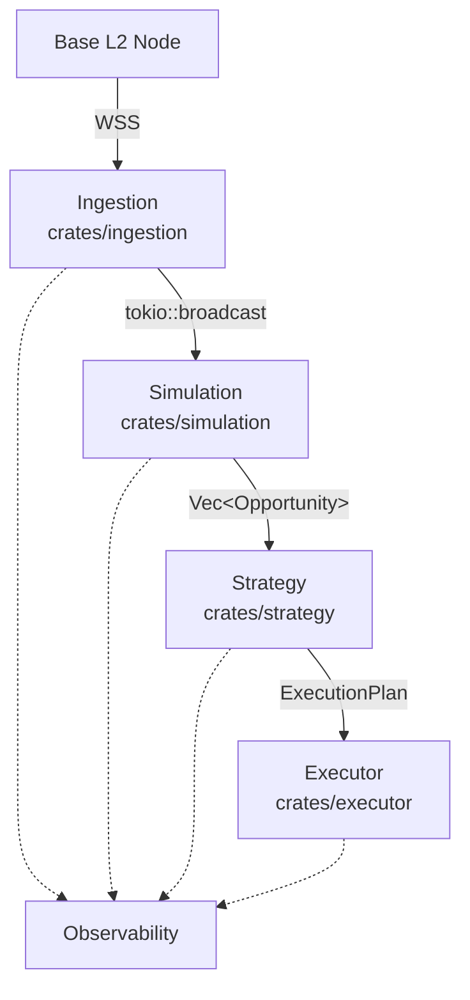

# Pyralis Engine
A V4 hook-aware EVM simulation and MEV detection framework in Rust.

I am building this to prototype and validate MEV ideas on Base before anything touches live capital. The engine takes chain data in real time, runs local simulations, scores opportunities, and outputs an execution plan to either dry-run or live execution.

## License
Dual-licensed under MIT and Apache-2.0. See `LICENSE-MIT` and `LICENSE-APACHE`.
